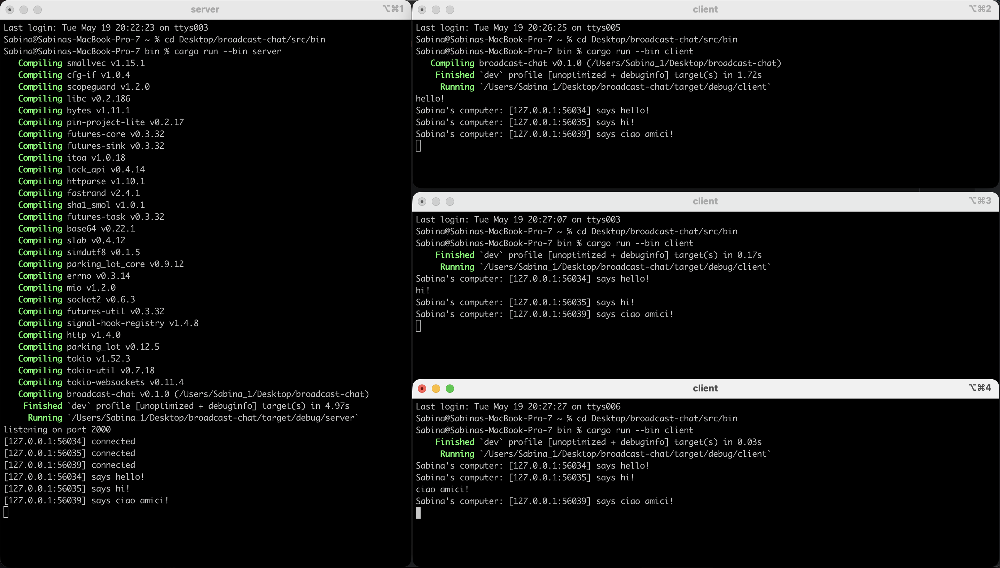
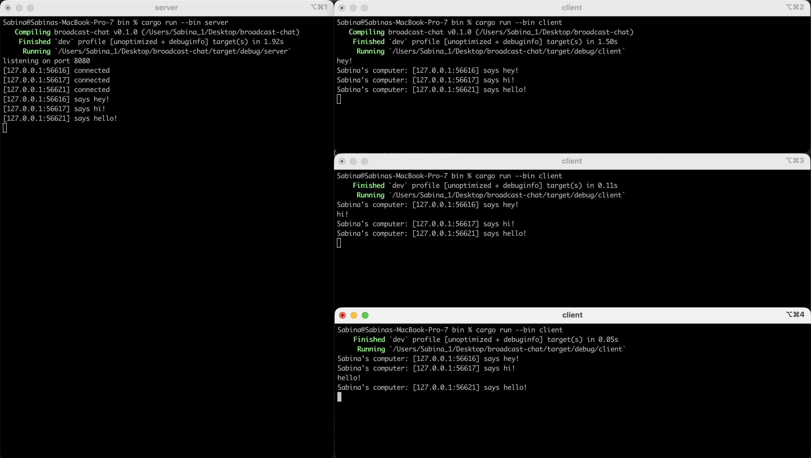

## Module 10 Reflection

#### Experiment 2.1: Original Code and How it Runs

Pada eksperimen ini dijalankan aplikasi broadcast chat menggunakan websocket asynchronous: satu server
dan tiga client secara bersamaan.

Setiap client dapat mengirim pesan ke server, kemudian server akan melakukan broadcast pesan 
tersebut ke seluruh client yang sedang terkoneksi.

Asynchronous programming cocok digunakan pada aplikasi chat karena banyak client dapat menunggu 
pesan secara bersamaan tanpa harus membuat thread baru untuk setiap koneksi.

 

#### Experiment 2.2: Modifying Port

Pada eksperimen ini dilakukan perubahan websocket port menjadi 8080 pada sisi server dan client.

Kedua sisi harus menggunakan port yang sama agar websocket connection dapat berhasil dilakukan.

Selain itu, websocket protocol yang digunakan tetap sama yaitu `ws://`

Perubahan port perlu dilakukan pada URL websocket server yang digunakan client dan juga binding
address pada server. Eksperimen ini tidak mengubah pengiriman pesan antar client.